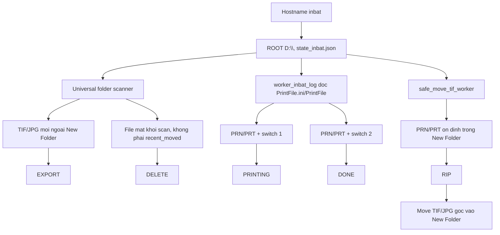
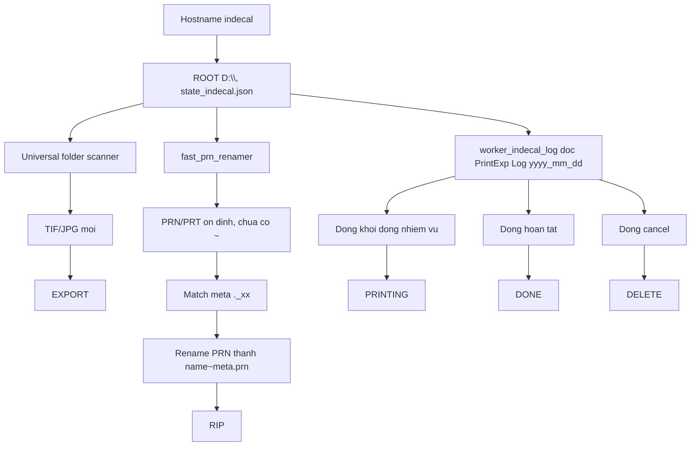
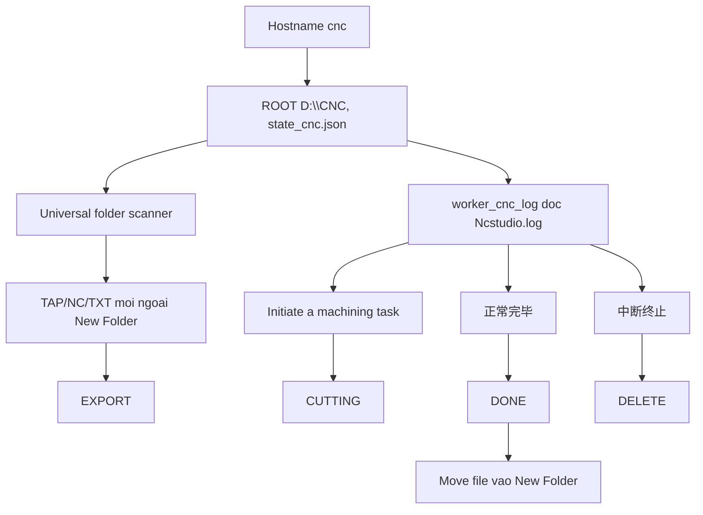

# Audit logic may tram QuanLyXuong.py

Ngay audit: 2026-07-09

## Pham vi da doc

- `QuanLyXuong.py`: client may tram, quet folder, doc log may, gui event len server.
- `qlx_workstation_logic.py`: module logic thuan moi tach de unit test.
- `tests/test_qlx_workstation_logic.py`: test cho InBat, InDecal, CNC.

## Luong InBat

Kiem tra chinh:

- `EXPORT`: TIF/JPG moi, khong phai file meta/runtime.
- `RIP`: PRT/PRN on dinh trong `New Folder`.
- `PRINTING/DONE`: doc snapshot PrintMon, switch `1/2`.
- `DELETE`: diff giua lan scan truoc va hien tai, bo qua file vua move.

## Luong InDecal

Kiem tra chinh:

- PRN chua co `~` khong danh dau processed qua som, de renamer tiep tuc xu ly.
- PRN co `~ghost`, `~error`, `~skipped` khong gui event moi.
- Log duoc doc theo chunk day du dong; dong cut giua chung duoc doi lan sau.
- Loi da fix: file meta dang ten `._tf`/`._jg` khong duoc nhan dien neu chi dung `os.path.splitext`. Pure rule moi nhan dien bang basename.

## Luong CNC

Kiem tra chinh:

- `CUTTING/DONE/DELETE` phu thuoc state may `IDLE/SIMULATING/CUTTING`.
- Sau `DONE`, file CNC duoc move vao `New Folder`; `recent_moved` chan scanner gui `DELETE` gia.

## Hostname/machine

Hien tai mapping hop le:

| Hostname | Machine | Root |
|---|---|---|
| `inbat` | `inbat` / `InBat` | `D:\` |
| `indecal` | `indecal` / `InDecal` | `D:\` |
| `cnc` | `cnc` / `CNC` | `D:\CNC` |

Da bo sung:

- Co the khai bao alias bang `QLX_MACHINE_ALIASES`, vi du `inbat=INBAT-PC,PRINT-01;indecal=DECAL-PC;cnc=CNC-BACKUP`.

Rui ro con lai:

- Can dien alias that neu ten may trong xuong khong dung chinh xac `inbat`/`indecal`/`cnc`.

## Gui trung, mat mang, restart, rename/delete

| Tinh huong | Hien trang | Danh gia |
|---|---|---|
| Gui trung do move file | `recent_moved` chan trong 900s | Tot cho move noi bo; chua durable qua restart |
| Mat mang khi gui event | `process_event` ghi vao SQLite outbox, worker nen retry co backoff | Tot hon: worker scan/log khong bi block |
| Restart | `state_*.json` luu processed path, `agent_outbox_*.db` luu event pending | Tot hon: event da enqueue con ton tai sau restart |
| File doi ten | Diff scan thay delete path cu + create path moi | Co the tao `DELETE` + `EXPORT/RIP`, khong co semantic rename |
| File xoa that | Diff scan gui `DELETE` | Dung, tru file vua move noi bo |
| Server nhan event trung | Client khong co idempotency key rieng | Can server dedupe theo `(machine,path,event_type,forced_base_id,time-window)` hoac file hash |

## Tach logic thuan

Da tach vao `qlx_workstation_logic.py`:

- `resolve_machine_config`
- `is_target_file_for_machine`
- `is_export_file`
- `is_meta_file`
- `get_expected_meta`
- `classify_created_path`
- `plan_scan_events`
- `parse_inbat_printmon_snapshot`
- `parse_indecal_log_lines`
- `parse_cnc_log_lines`

`QuanLyXuong.py` da dung module moi cho:

- mapping hostname sang cau hinh may;
- rule target file/export/meta.

## Test integration scan folder

Da them `tests/test_quanlyxuong_scan.py` de mo phong folder ngay bang temp dir:

- InBat: TIF/JPG ngoai folder + PRN/PRT trong `New Folder`.
- InDecal: TIF/JPG trong folder con + PRN/PRT trong `New Folder`.
- CNC: TAP/NC/TXT ngoai folder + TAP/NC/TXT trong `New Folder`, bo qua anh.
- One-cycle scanner: file moi tao `EXPORT`, file bien mat tao `DELETE` qua fake `process_event`.
- One-cycle InDecal: PRN chua co `~` chua ghi processed; sau rename co `~meta` va `recent_moved` thi tao `RIP`, khong tao `DELETE` gia.
- One-cycle outbox: scanner tao `EXPORT` va ghi vao SQLite outbox tam bang `process_event` that.

Test nay khong goi server, khong doc/ghi folder xuong that.

## Khuyen nghi tiep theo

1. Dua alias hostname vao config thay vi hardcode.
2. Tach tiep worker log thanh adapters IO mong, goi parser pure.
3. Them preflight "san sang thay ban cu" tong hop quality/build/backup/outbox/env.
4. Sau khi chay thu V2, ghi lai hostname that cua tung may vao `.env`/system env.
